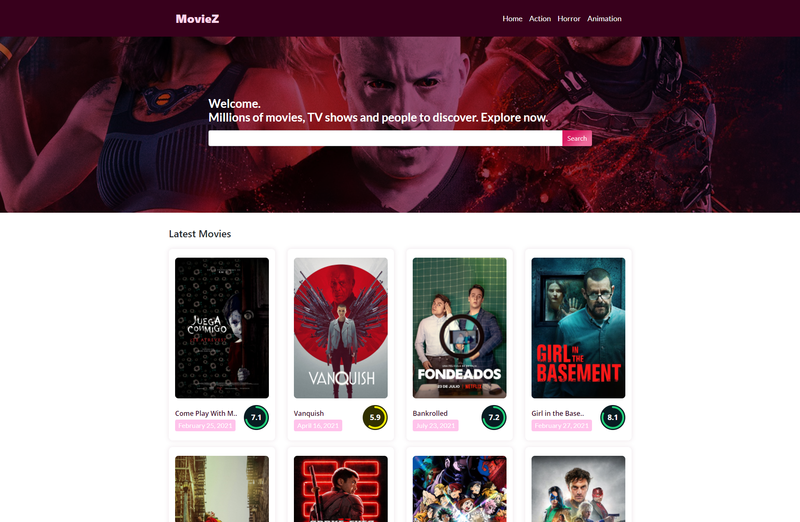

# MovieZ
<!-- PROJECT LOGO -->
<br />
<p align="center">
  <h3 align="center">MovieZ [TMDB API & JS]</h3>

  <p align="center">
    An Awesome Frontend Design Template to jumpstart your buisness!
    <br />
    <br />
    <a href="https://fahimtayebee9.github.io/Agency-website/">View Demo</a>
    ·
    <a href="https://fahimtayebee9.github.io/Agency-website/issues">Report Bug</a>
    ·
    <a href="https://fahimtayebee9.github.io/Agency-website/issues">Request Feature</a>
  </p>
</p>


<!-- TABLE OF CONTENTS -->
<details open="open">
  <summary>Table of Contents</summary>
  <ol>
    <li>
      <a href="#about-the-project">About The Project</a>
      <ul>
        <li><a href="#built-with">Built With</a></li>
      </ul>
    </li>
    <li>
      <a href="#getting-started">Getting Started</a>
      <ul>
        <li><a href="#installation">Installation</a></li>
      </ul>
    </li>
    <li><a href="#usage">Usage</a></li>
    <li><a href="#contact">Contact</a></li>
  </ol>
</details>


<!-- ABOUT THE PROJECT -->
## About The Project



This a simple movie listing website template. It is made with TMDB API and Basic OOP concepts of JavaScript and ES6 modules. In this template it is shown how to collect data and render them using javascript to website. Any data from any api can be used same as this. Just need to change urls in the UrlManager. That's it. 
Have Fun Playing With API.

A list of commonly used resources that I find helpful are listed in the acknowledgements.

### Built With

This section should list any major frameworks that you built your project using. Leave any add-ons/plugins for the acknowledgements section. Here are a few examples.
* [Bootstrap](https://getbootstrap.com)
* [JQuery](https://jquery.com)
* [AOS](https://michalsnik.github.io/aos/)
* [FontAwesome](https://fontawesome.com/)
* [TMDB](https://www.themoviedb.org/)
* [JavaScript](https://developer.mozilla.org/en-US/docs/Web/JavaScript)

<!-- GETTING STARTED -->
## Getting Started

This is an example of how you may give instructions on setting up your project locally.
To get a local copy up and running follow these simple example steps.

### Installation

1. Clone the repo by downloading zip or
2. Clone the repo
   ```sh
   git clone https://github.com/fahimtayebee9/MovieZ
   ```


<!-- USAGE EXAMPLES -->
## Usage

This is project can be used for collecting data from REST API.

<!-- CONTACT -->
## Contact

LinkedIn - [Md Fahim Tayebee](https://www.linkedin.com/in/ftayebee/) - tayebee@fahimtayebee.com

Project Link: [https://github.com/fahimtayebee9/MovieZ](https://github.com/fahimtayebee9/MovieZ)


<!-- MARKDOWN LINKS & IMAGES -->
<!-- https://www.markdownguide.org/basic-syntax/#reference-style-links -->
[contributors-shield]: https://img.shields.io/github/contributors/othneildrew/Best-README-Template.svg?style=for-the-badge
[contributors-url]: https://github.com/othneildrew/Best-README-Template/graphs/contributors
[forks-shield]: https://img.shields.io/github/forks/othneildrew/Best-README-Template.svg?style=for-the-badge
[forks-url]: https://github.com/othneildrew/Best-README-Template/network/members
[stars-shield]: https://img.shields.io/github/stars/othneildrew/Best-README-Template.svg?style=for-the-badge
[stars-url]: https://github.com/othneildrew/Best-README-Template/stargazers
[issues-shield]: https://img.shields.io/github/issues/othneildrew/Best-README-Template.svg?style=for-the-badge
[issues-url]: https://github.com/othneildrew/Best-README-Template/issues
[license-shield]: https://img.shields.io/github/license/othneildrew/Best-README-Template.svg?style=for-the-badge
[license-url]: https://github.com/othneildrew/Best-README-Template/blob/master/LICENSE.txt
[linkedin-shield]: https://img.shields.io/badge/-LinkedIn-black.svg?style=for-the-badge&logo=linkedin&colorB=555
[linkedin-url]: https://linkedin.com/in/othneildrew
[product-screenshot]: assets/img/ss_main.png
